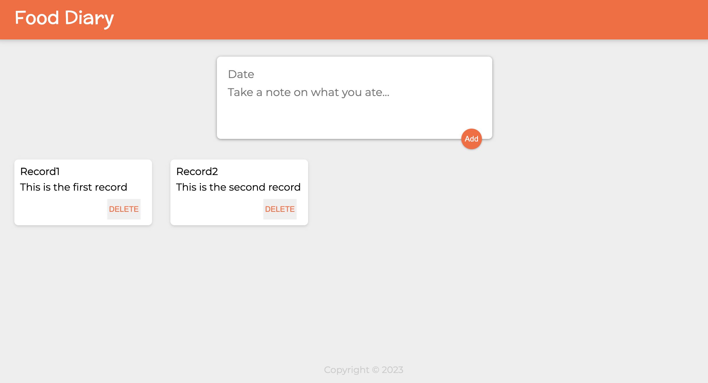
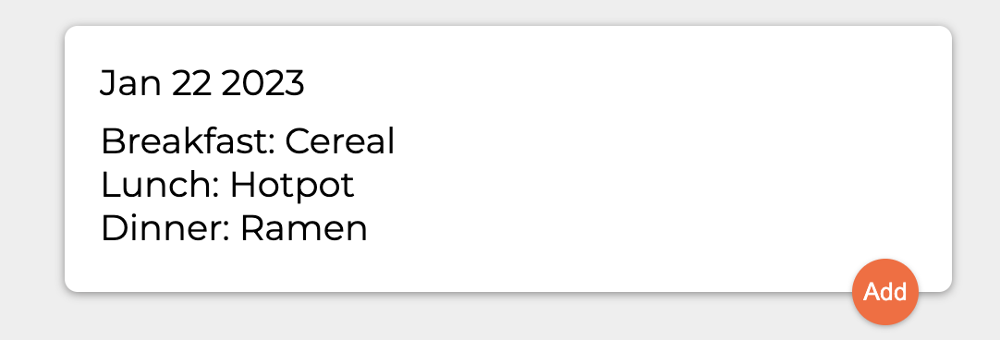
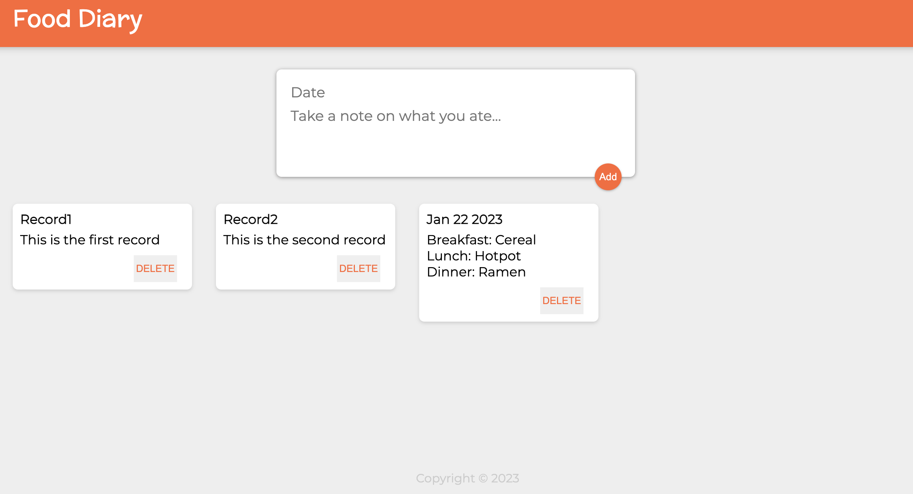

# Jamie's Food Diary App

Use the app to record what you eat!

I build the app with Node.js, React for the frontend and Express.js for the backend. 
The app supports GET, POST, and DELETE HTTP methods. 
It stores all the data in an array.  

When the app starts, it fetches and displays two records stored
in the array. 

Records in the array

You can create new records. 

You can also delete records.   

Enjoy writing your food diary with the app!
